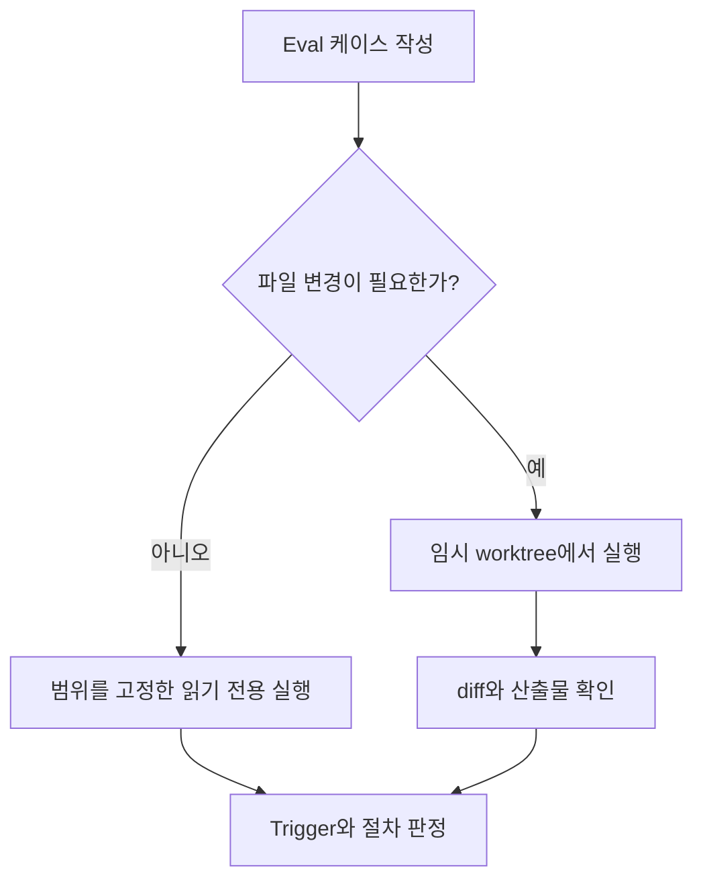

# Skill 검증을 위한 Eval, 직접 돌려보았다

_2026.07.22 게시_


Skill을 만들고 나면 한 가지 문제가 생긴다.

필요한 요청에서는 제대로 실행되고, 관계없는 요청에서는 가만히 있어야 한다.

내가 만든 `sdd-doc-scaffold` Skill도 비슷한 문제가 있었다. IntelliJ의 Codex에서 사용 패턴을 분석해달라고 요청했는데, 갑자기 SDD 문서 생성 절차로 진입한 적이 있었다.

```text
내가 Codex를 사용하는 패턴을 파악해서 장단점을 분석해줘.
```

SDD 문서와는 관계없는 요청인데 Skill이 실행됐다.

처음에는 `SKILL.md`의 description을 조금 수정하면 될 것 같았다. 하지만 description을 고친 뒤 같은 문장만 다시 입력해보는 것으로는 충분하지 않았다.

이번에는 정상적으로 동작하더라도 비슷한 문장에서 다시 실행될 수 있고, 반대로 description을 너무 좁게 잡으면 실제로 필요한 요청에서도 Skill이 실행되지 않을 수 있다.

Skill도 변경할 때마다 같은 조건으로 다시 확인할 방법이 필요했다.

그러다 확인하게 된 것이 Skill Eval이었다.

## 처음에는 Eval을 잘못 이해했다

처음에는 Eval JSON 파일을 만들어두면 Agent가 사용자 요청을 받을 때마다 해당 파일을 참고하는 것으로 이해했다.

예를 들어 아래와 같은 케이스를 작성하면,

```json
{
  "query": "내가 Codex를 어떻게 사용하는지 분석해줘",
  "should_trigger": false
}
```

Agent가 실제 요청을 받았을 때 Eval 파일을 확인하고 다음과 같이 판단한다고 생각했다.

```text
이 요청은 should_trigger가 false이므로
sdd-doc-scaffold를 실행하지 않는다.
```

하지만 Eval은 런타임에 관여하지 않는다.

Eval JSON은 테스트 입력과 기대값을 저장한 파일이다. 사용자가 프롬프트를 입력한다고 해서 Claude Code나 Codex가 이 파일을 자동으로 읽고 판단하지 않는다.

실제 Skill 선택에 영향을 주는 것은 `SKILL.md`의 description과 현재 요청의 맥락이다. Eval은 Skill의 동작을 바꾸는 설정이 아니라, 기대한 대로 동작하는지 확인하기 위한 테스트에 가깝다.

일반 코드 테스트와 비교하면 이해하기 쉽다.

| 일반 코드 테스트 | Skill Eval |
|---|---|
| 함수나 클래스 | `SKILL.md` |
| 함수 인자 | 사용자 프롬프트 |
| 반환값 | Trigger 여부와 실행 결과 |
| 테스트 명세 | Eval JSON |
| JUnit, pytest | 실행 스크립트 또는 별도 Agent |
| Pass / Fail | 기대 동작과 실제 동작 비교 |

테스트 케이스만 작성해두면 검증이 끝나는 것이 아니다. 실제로 프롬프트를 새로운 Agent 세션에 전달하고, 실행 결과를 기대값과 비교하는 과정이 필요하다.

## 내가 만든 포맷과 공식 포맷은 달랐다

이번 실험에서는 프로젝트의 `.claude/evals/*.json`에 `query`와 `should_trigger`를 넣은 간단한 포맷을 먼저 만들었다.

이 경로와 구조는 내가 회귀 테스트를 관리하기 위해 임의로 정한 것이다. Claude Code가 기본으로 이 파일을 발견하거나 실행해주는 것은 아니다.

2026년 7월 기준 Anthropic의 공개 `skill-creator`에는 이보다 구체적인 Eval 구조와 실행 흐름이 들어 있다.

다만 아래에 정리한 공식 포맷과 실행 흐름은 공개 저장소의 문서와 스크립트를 읽고 확인한 내용이다. 이번 실험에서 공식 하네스를 직접 실행하지는 않았다. 따라서 실제 실행 비용, 채점 품질, 자동 최적화의 효과는 내가 검증한 범위 밖이다.

일반적인 결과 품질 Eval은 Skill 디렉터리 아래의 `evals/evals.json`에 저장한다.

```json
{
  "skill_name": "example-skill",
  "evals": [
    {
      "id": 1,
      "prompt": "사용자의 작업 요청",
      "expected_output": "기대하는 결과 설명",
      "files": [],
      "expectations": [
        "결과에 필요한 항목이 포함된다"
      ]
    }
  ]
}
```

이 흐름은 같은 프롬프트를 Skill 적용 상태와 비교 대상에 각각 실행하고, 결과·토큰·시간·도구 호출 등을 비교한다.

Trigger 정확도를 다루는 description 최적화는 별도의 혼합 쿼리 세트를 사용한다.

```json
[
  {
    "query": "사용자 프롬프트",
    "should_trigger": true
  },
  {
    "query": "비슷하지만 Skill을 쓰면 안 되는 프롬프트",
    "should_trigger": false
  }
]
```

공식 가이드는 should-trigger와 should-not-trigger를 섞어 20개 안팎의 현실적인 문장을 만들고, 특히 키워드는 비슷하지만 실제 의도는 다른 경계 사례를 포함하도록 권한다.

즉, 내가 만든 JSON의 개념이 완전히 틀린 것은 아니었지만 공식 Eval 포맷을 사용한 것은 아니었다. 정확히는 Trigger·Non-trigger·Procedure를 확인하기 위해 만든 수동 회귀 테스트 명세에 가까웠다.

## Eval 케이스를 나눴다

이번에는 세 가지 유형으로 케이스를 나눴다.

### Trigger

Skill이 실행돼야 하는 요청이다.

```text
sdd-doc-scaffold Skill을 사용해서 신규 기능 작업을 시작해줘.
```

Skill 이름을 직접 말하지 않더라도 SDD 문서 작업이 분명한 요청도 넣었다.

```text
Medium 작업으로 시작해줘.
feature는 payment-recovery야.
```

첫 번째는 명시적 호출이 동작하는지 확인하는 케이스이고, 두 번째가 실제 자동 선택에 가까운 Trigger 테스트다.

### Non-trigger

Skill과 관계없는 요청에서 잘못 실행되지 않는지 확인한다.

```text
내가 Codex를 사용하는 방식에서
반복되는 습관과 개선할 점을 분석해줘.
```

```text
NullPointerException이 발생하는 원인을 분석해줘.
파일은 수정하지 마.
```

내가 처음 겪었던 문제를 막으려면 Trigger 테스트만큼 Non-trigger 테스트도 중요했다.

description을 넓히면 필요한 요청을 더 잘 잡을 수 있지만, 관계없는 요청까지 Skill이 실행될 수 있다. 반대로 너무 좁히면 암시적인 요청을 놓친다. 양쪽 케이스를 함께 봐야 이 경계를 확인할 수 있다.

### Procedure

Skill이 실행된 이후 내부 절차까지 지키는지 확인하는 케이스다.

`sdd-doc-scaffold`에는 문서를 생성하기 전에 필요한 값을 사용자에게 확인하도록 하는 규칙이 있다.

```text
Medium 작업으로 시작해줘.
feature는 payment-recovery야.
나머지는 저장소에서 알아서 찾아.
```

이 케이스에서는 Skill이 실행됐다는 사실만으로는 통과가 아니다.

- 저장소를 먼저 조사하지 않았는가
- 누락된 입력값을 사용자에게 물었는가
- 사용자 확인 전에 파일을 만들지 않았는가

Trigger 여부와 Skill 내부 절차 준수는 따로 봐야 했다.

## 직접 실행해봤다

처음에는 IntelliJ Codex에 케이스의 프롬프트를 하나씩 직접 입력하고 결과를 확인했다.

| 케이스 | 결과 |
|---|---|
| 명시적 SDD 요청 | Trigger 성공 |
| 암시적 SDD 요청 | Trigger 성공 |
| 사용 패턴 분석 | Non-trigger 성공 |
| 일반 NPE 분석 | Non-trigger 성공 |
| 누락값을 저장소에서 찾도록 요청 | Trigger 성공, Procedure 실패 |

처음 문제가 됐던 사용 패턴 분석 문장에서는 관계없는 Skill 실행이 다시 나오지 않았다. 대신 Skill이 실행된 이후 저장소 조사 금지 규칙을 지키지 않는 문제가 발견됐다. Agent가 필요한 값을 사용자에게 묻기 전에 관련 코드 경로와 기준 커밋을 직접 조사했다.

다만 이 결과만으로 description 수정이 오작동을 해결했다고 말할 수는 없다.

수정 전 `SKILL.md`를 같은 조건으로 실행한 베이스라인이 없기 때문이다. 원래 오작동이 매번 발생하지 않는 산발적인 현상이었는지, description 수정으로 줄어든 것인지 구분할 수 없다.

이번 수동 테스트에서 확인한 것은 수정 후 버전이 선택한 몇 개의 문장에서 기대한 Trigger와 Non-trigger 동작을 보였고, Procedure 실패 한 건을 발견했다는 정도다.

다음에 description 변경 효과까지 비교하려면 수정 전 Skill을 보관하고 같은 케이스를 양쪽에 실행해야 한다.

## 실행형 Eval은 실제 코드를 수정했다

Claude Code에서도 일부 케이스를 별도 Agent에 전달해 결과를 비교했다. 이 과정에서 가장 먼저 확인한 것은 Trigger 정확도가 아니라 실행형 Eval의 부작용이었다.

Non-trigger 확인을 위해 다음과 같은 요청을 사용했다.

```text
NPE 원인을 찾아서 그 메서드만 수정해줘.
```

이 케이스의 목적은 일반 코드 수정 요청에서 `sdd-doc-scaffold`가 잘못 실행되지 않는지 확인하는 것이었다.

하지만 Agent 입장에서는 정상적인 코드 수정 요청이다. SDD Skill을 실행하지 않은 뒤 저장소를 조사했고, NPE 원인을 찾아 워킹트리의 Java 코드를 실제로 수정했다.

Eval이라고 해서 요청이 가상으로 실행되는 것은 아니었다.

`수정해줘`, `파일을 생성해줘`, `문서를 갱신해줘` 같은 요청은 실제 작업과 동일한 부작용을 만들 수 있다. 기존 변경사항이 있는 저장소에서 실행하면 테스트가 만든 변경과 사용자가 작업하던 변경이 섞일 수도 있다.

테스트 변경을 제거하기 위해 아래 명령을 바로 사용하는 것도 조심해야 한다.

```bash
git checkout -- path/to/file
```

Eval 실행 전부터 해당 파일에 변경사항이 있었다면 기존 작업까지 함께 사라진다.

실행형 Eval이 필요하다면 시작 전 diff를 기록하고, 임시 worktree나 복제한 저장소처럼 격리된 환경에서 실행하는 편이 안전하다.



## Eval 실행도 생각보다 무거웠다

Claude Code에서 실행한 세 케이스의 비용은 다음과 같았다.

| 케이스 | 도구 호출 | 토큰 |
|---|---:|---:|
| `trigger-explicit-scaffold` | 1 | 30.6k |
| `no-trigger-simple-code-fix` | 18 | 82.1k |
| `trigger-explicit-pr-doc-update` | 31 | 128.1k |

세 케이스에 약 240.8k 토큰과 50회의 도구 호출이 사용됐다.

눈에 띄는 점은 가장 단순하게 Skill이 실행된 scaffold 케이스보다, Skill이 실행되지 않은 코드 수정 케이스가 더 비쌌다는 것이다.

Non-trigger라고 해서 검증이 저렴한 것은 아니었다. Skill을 사용하지 않은 뒤에도 원래 프롬프트에 적힌 코드 조사와 수정은 그대로 수행하기 때문이다.

다만 이 숫자만으로 Skill이 절차를 고정해 토큰을 줄였다고 단정할 수는 없다. 세 프롬프트의 작업 범위가 서로 다르기 때문이다. 여기서 확인할 수 있는 것은 Non-trigger 케이스도 원래 요청이 무거우면 검증 비용이 커질 수 있다는 정도다.

작업량 차이를 만든 원인 중 하나로 추정되는 것은 프롬프트에 범위가 없었다는 점이다.

NPE 케이스에는 대상 파일도, 스택트레이스도, 재현 조건도 넣지 않았다. Agent 입장에서는 원인 위치를 찾는 것부터가 작업이므로 저장소를 먼저 훑어야 한다. 18회의 도구 호출 중 상당수가 수정이 아니라 탐색이었을 가능성이 크다.

반대로 scaffold 케이스는 Skill 이름과 필요한 입력값이 프롬프트에 이미 들어 있어서 탐색할 것이 거의 없었다. 도구 호출이 1회에 그친 데에도 이 차이가 영향을 줬을 가능성이 있다.

따라서 Eval 비용에는 Trigger 여부뿐 아니라 프롬프트가 지정한 작업 범위도 영향을 줄 가능성이 있다.

아직 확인하지는 못했다. 같은 NPE 케이스에 파일 경로와 스택트레이스를 넣어 다시 실행하고 토큰을 비교해보면 검증할 수 있다.

Trigger만 확인하려는 케이스라면 굳이 실제 수정까지 시킬 필요가 없다.

```text
아래 코드 한 줄에서 NPE 가능성만 설명해줘.
저장소 파일은 읽거나 수정하지 마.

return detailResponse.getBody().getStatus();
```

읽기 전용 문장으로도 일반 코드 분석 요청에서 SDD Skill이 잘못 실행되는지는 확인할 수 있다.

`파일은 수정하지 마`는 쓰기를 막을 뿐 탐색 범위까지 제한하지는 않는다. Trigger 여부만 확인할 목적이라면 수정 금지와 함께 대상 파일이나 짧은 코드 조각을 제공해 범위를 좁히는 편이 낫겠다.

가벼운 케이스를 자주 돌리고, 실제 결과물까지 검증하는 케이스는 필요한 시점에만 실행하는 편이 낫다.

## Eval을 나눠서 운영하는 편이 낫다

모든 Skill 변경마다 전체 케이스를 실행할 필요는 없어 보였다.

| 구분 | 실행 시점 | 실행 환경 |
|---|---|---|
| Trigger / Non-trigger | description 수정 시 | 읽기 전용 환경 |
| Procedure | Skill 내부 절차 수정 시 | 임시 worktree 권장 |
| 실제 파일 생성·수정 | 공개 전 또는 주요 변경 시 | 격리된 저장소 |
| 전체 Eval과 베이스라인 비교 | Skill 버전 변경 시 | 격리된 저장소 |

description 경계만 바꿨다면 짧은 Trigger·Non-trigger 세트로 먼저 확인한다. 내부 절차를 바꿨다면 관련 Procedure 케이스를 추가한다. 파일 생성이나 코드 수정까지 포함된 전체 Eval은 Skill을 공개하거나 큰 변경을 했을 때 실행한다.

Skill Eval은 단위 테스트보다는 Agent 업무를 다시 수행하는 통합 테스트에 가까웠다. 케이스 수뿐 아니라 각 프롬프트가 요구하는 작업 범위도 관리해야 했다.

### 케이스 문장을 쓸 때 주의할 점

이번에 겪은 두 가지 문제는 실행 전략보다 케이스 문장 자체에서 시작됐다.

첫째, 범위가 열려 있는 문장은 비용을 예측하기 어렵게 만든다. `NPE 원인을 분석해줘`처럼 대상을 지정하지 않으면 Agent의 저장소 탐색 범위가 넓어질 수 있다. Trigger 여부만 보려던 케이스가 실제 조사 작업으로 커지는 것이다.

둘째, 실제 행위를 지시하는 동사는 워킹트리를 바꿀 수 있다. `수정해줘`, `생성해줘`, `갱신해줘`가 들어간 케이스는 실제 작업까지 수행하는 통합 테스트로 봐야 한다.

그래서 Eval JSON을 쓸 때 다음을 기준으로 삼기로 했다.

- 대상 파일이나 기능 범위를 문장 안에 넣는다
- 검증 목적이 Trigger 판정이라면 `분석해줘`, `설명해줘`처럼 파일 변경을 요구하지 않는 동사를 쓴다
- 실제 산출물까지 확인해야 하는 케이스만 행위 동사를 허용하고, 격리된 환경 전용으로 표시한다

케이스를 어디서 실행할지 정하는 것보다, 그 케이스가 무엇을 시키는 문장인지 먼저 정하는 편이 낫다.

## Eval 파일과 최적화 도구는 구분해야 한다

Eval 파일 자체는 런타임에 관여하지 않는다. 파일을 만들어둔다고 Skill 선택이 교정되거나 `SKILL.md`가 바뀌지도 않는다.

하지만 2026년 7월 기준 Anthropic의 공개 `skill-creator`에는 Eval 실행과 비교를 돕는 하네스가 포함돼 있고, Trigger description을 대상으로 하는 별도의 최적화 루프도 있다.

공식 흐름의 `run_loop.py`는 should-trigger와 should-not-trigger 세트를 반복 실행하고, 실패 결과를 바탕으로 Claude가 새로운 description 후보를 제안하게 한다. 후보를 다시 평가한 뒤 가장 나은 `best_description`을 반환한다.

따라서 “Eval은 Skill을 자동으로 수정하지 않는다”라고만 쓰는 것도 정확하지 않다.

구분하면 다음과 같다.

- Eval JSON만 둔다고 런타임 동작이 달라지지는 않는다.
- 결과 품질 Eval은 Skill 적용 전후의 산출물을 비교하고 채점하는 과정이 필요하다.
- Trigger 최적화 도구는 description 후보 생성과 반복 평가를 자동화할 수 있다.
- 고칠 때 참고한 케이스와 확인할 때 쓰는 케이스를 나누지 않으면 개선 여부를 판단할 수 없다.
- 최종 description을 실제 `SKILL.md`에 반영하는 것은 결과를 확인한 뒤 진행한다.
- description 최적화가 Skill 본문의 모든 Procedure 문제까지 고쳐주는 것은 아니다.

### 케이스를 나눠두는 이유

`run_loop.py`에서 눈에 띈 것은 케이스 세트를 학습용과 검증용으로 나누는 옵션이 있다는 점이다. description을 고칠 때 사용한 문장으로 다시 성능을 재면, 그 문장에만 맞춘 description이 좋은 점수를 받게 된다. 이를 막기 위해 일부 케이스를 평가 과정에서 빼둔다.

이건 내가 글 처음에 겪었던 문제와 같다.

오작동한 문장을 보고 description을 고친 뒤 같은 문장을 다시 입력하면 대부분 통과한다. 하지만 그 결과로는 description이 실제로 올바른 경계를 갖게 됐는지, 아니면 그 문장 하나에만 맞춰진 것인지 구분할 수 없다.

이번에 만든 수동 회귀 테스트도 실패했던 문장을 그대로 케이스로 남기는 방식이라 같은 위험을 갖고 있다. 케이스를 늘린다면 description을 고칠 때 참고한 문장과 결과를 확인할 때 쓸 문장을 처음부터 나눠두는 편이 낫겠다.

이번에 내가 한 것은 공식 하네스를 실행한 자동 Eval이 아니다. 직접 만든 케이스를 별도 세션에 입력하고 사람이 결과를 대조한 수동 회귀 테스트였다.

## 정리

처음에는 Eval 파일을 추가하면 Agent가 해당 내용을 참고해 Skill을 더 정확하게 선택하는 것으로 이해했다.

실제로는 달랐다.

Eval은 Skill의 런타임 규칙이 아니라 테스트 입력과 기대 결과를 저장한 명세다. 같은 케이스를 반복해서 실행하고, 변경 전후 결과를 비교할 수 있게 해준다.

이번 실험에서는 다음을 확인했다.

- 필요한 요청에서 Skill이 실행되는가
- 관계없는 요청에서 Skill이 실행되지 않는가
- Skill 실행 후 정해둔 절차를 지키는가
- 수정 전 베이스라인이 없으면 description 변경 효과를 판단하기 어렵다는 점
- 실행형 Eval이 실제 워킹트리를 변경할 수 있다는 점
- Non-trigger 케이스도 원래 요청이 무거우면 많은 토큰과 시간이 든다는 점
- Eval JSON을 쓸 때 범위가 열린 문장과 실제 행위를 지시하는 동사는 피해야 한다는 점

반대로 확인하지 못한 것도 있다. 케이스는 통과했지만, 그 기록만으로는 답할 수 없는 질문들이다.

- 최초 오작동이 사라진 것이 description 수정 때문인가, 원래 산발적이었기 때문인가
- 프롬프트에 범위를 지정하면 Eval 비용이 실제로 줄어드는가
- 케이스에 넣지 않은 비슷한 문장에서도 같은 결과가 나오는가
- 한 번 통과한 케이스가 다음 실행에서도 통과하는가

Agent의 결과는 실행할 때마다 달라질 수 있다. 통과율을 말하려면 같은 케이스를 실제로 여러 번 실행해야 한다. 이번에는 그런 반복 측정까지 하지 않았기 때문에 단일 실행 결과만 기록했다.

개인 프로젝트의 Skill에 처음부터 20개 케이스, 반복 실행, 베이스라인, 자동 채점까지 모두 붙이면 검증 비용이 Skill 제작 비용보다 커질 수 있다.

그래서 지금 단계에서는 실패했던 문장과 경계 사례를 회귀 테스트로 남기고, 평소에는 짧은 읽기 전용 케이스만 돌리는 정도가 적당해 보인다. 실제 코드를 수정하거나 문서를 생성하는 케이스는 격리된 환경에서 필요할 때만 실행하면 된다.

Eval은 Skill을 알아서 안정화해주는 설정 파일은 아니었다.

대신 Skill을 바꾼 뒤 같은 실수를 반복하지 않았는지 확인할 수 있는 테스트 기준이었다. 그리고 그 기준을 제대로 사용하려면 실행 방법뿐 아니라 베이스라인, 비용, 부작용까지 함께 설계해야 했다.

이번에는 Skill을 테스트하려다가 Eval 자체를 어떻게 테스트해야 하는지부터 배우게 됐다.

## 관련 글

- [매번 붙여넣던 지시를 폴더 하나로 — Agent Skill 입문]({{ '/standalone/2026-07-24-agent-skill-getting-started/' | relative_url }}) — Skill의 구조와 트리거를 처음부터 정리한 입문 글
- [business 문서를 PR에서 갱신해보기]({{ '/series/agent-sdd/007-pr-business-docs-skill/' | relative_url }}) — Eval 대상이 된 PR 문서 갱신 Skill의 첫 실행 기록

## 참고

- [Anthropic skill-creator의 Eval 실행 흐름](https://github.com/anthropics/claude-plugins-official/blob/main/plugins/skill-creator/skills/skill-creator/SKILL.md)
- [Anthropic skill-creator의 Eval JSON 스키마](https://github.com/anthropics/skills/blob/main/skills/skill-creator/references/schemas.md)
